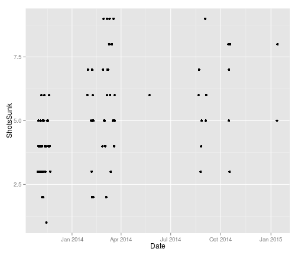

## The Solution
Predict when I will be good enough using a model fitted to historical data. 

<iframe width='100%' height='300' src='https://en.wikipedia.org/wiki/Predictive_modelling' frameborder='0'></iframe>

---

## The Data
Luckily I have built up a small record of my basketball accuracy over time. Each data point shows how many shots I sunk (out of ten), a fixed distance from the hoop. There are 79 recorded attempts.

This data can be used to predict when I will be good at basketball!

---

## The Shiny App

Please go here to view my app:
https://tim-fan.shinyapps.io/basketball-accuracy

The app will allow you to
* View the data, plotted either by date or by number of attempts
* Fit a polynomial to the data to predict when I will sink 10/10 shots

Extras:
* Source for the shiny app:

  https://github.com/tim-fan/datasciencecoursera/tree/master/dataProducts/courseProject1/basketball-accuracy

* Source for this presentation: 

  https://github.com/tim-fan/slidifyPitch/tree/gh-pages

